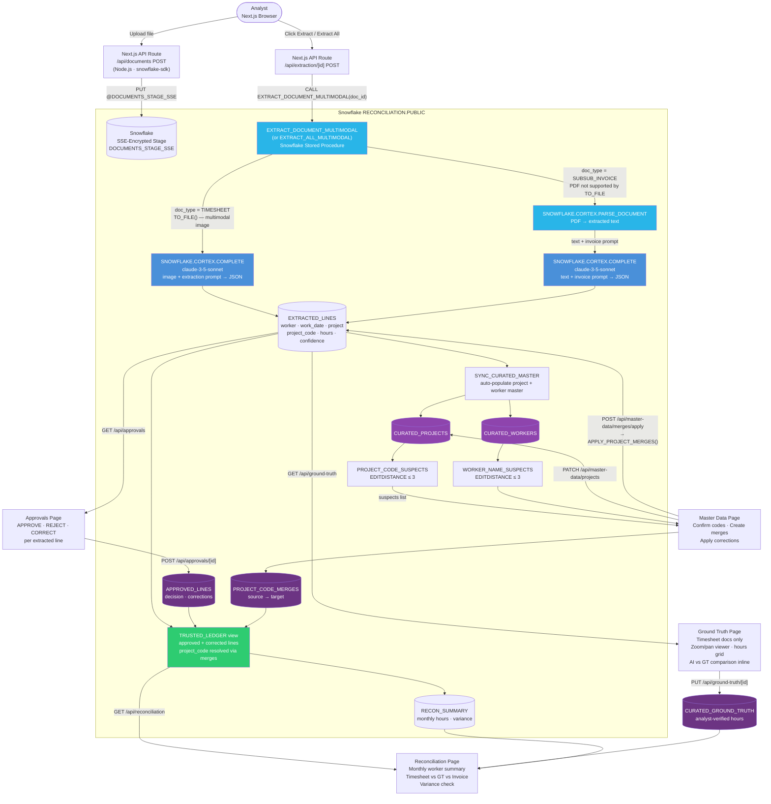

# Timesheet Reconciliation System

A hackathon project that converts timesheet screenshots and subcontract invoice PDFs into a trusted, validated financial ledger — automatically. Built on **Snowflake Cortex**, **Claude AI**, and a **Next.js** analyst app.

---

## The Problem

Subcontracting billing chains create a silent audit gap: the prime contractor holds timesheet screenshots, the agency holds invoices, and neither side has a structured system of record. Every month, someone manually compares images to spreadsheets, hoping nothing slipped through.

This system eliminates that gap by:
1. Extracting structured data directly from images and PDFs using Claude vision (via Snowflake Cortex)
2. Letting analysts enter ground truth and compare it inline against AI extraction
3. Producing a trusted approved ledger as the source of truth for reconciliation

---

## How LLM Calls Work

There are **no Python agents** in this system. All AI extraction happens inside Snowflake via stored procedures that call `SNOWFLAKE.CORTEX.COMPLETE` (Claude 3.5 Sonnet). The Next.js frontend triggers extraction by calling these stored procedures directly through the Snowflake SDK.



---

## Technology Stack

| Layer | Technology | Role |
|---|---|---|
| **Data Store** | Snowflake (`RECONCILIATION.PUBLIC`) | Tables, views, stored procedures, SSE stage |
| **AI Extraction** | `SNOWFLAKE.CORTEX.COMPLETE` (claude-3-5-sonnet) | Multimodal image→JSON for timesheets; text→JSON for invoice PDFs |
| **PDF Parsing** | `SNOWFLAKE.CORTEX.PARSE_DOCUMENT` | Extracts text from invoice PDFs before passing to COMPLETE |
| **Frontend** | Next.js 16 (App Router) + TypeScript | 5-page analyst review app at `localhost:3000` |
| **UI** | Tailwind CSS + shadcn/ui + TanStack Query v5 | Component library, data fetching, optimistic updates |
| **DB Client** | snowflake-sdk (Node.js) | Direct Snowflake connection from Next.js API routes |

---

## How It Works

### Extraction (Doc-Type-Aware)

All extraction runs inside Snowflake stored procedures. The Next.js frontend calls them via `runExecute()` in `lib/snowflake.ts` — no Python, no agents.

#### Timesheets (image files)

The stored procedure sends the raw image directly to Claude 3.5 Sonnet via `SNOWFLAKE.CORTEX.COMPLETE` with a multimodal prompt:

```sql
-- EXTRACT_DOCUMENT_MULTIMODAL — timesheet path
SELECT SNOWFLAKE.CORTEX.COMPLETE(
    'claude-3-5-sonnet',
    [{'role':'user','content':[
        {'type':'text',  'text': :timesheet_prompt},
        {'type':'image', 'source_media_type':'image/jpeg',
         'source': TO_FILE('@DOCUMENTS_STAGE_SSE', :filename)}
    ]}]
) INTO :llm_response;
```

The prompt instructs Claude to capture every project row per day, extract the alphanumeric project code (e.g. `006GI00000OBhiL`), return hours as decimals and dates as `YYYY-MM-DD`, and score confidence per field.

#### Subcontract Invoices (PDF files)

`CORTEX.COMPLETE` does not support PDF via `TO_FILE`. The procedure falls back to a two-step path:

```sql
-- Step 1: Extract text from PDF
SELECT SNOWFLAKE.CORTEX.PARSE_DOCUMENT(
    '@DOCUMENTS_STAGE_SSE', :filename,
    {'mode': 'LAYOUT'}
):content::STRING INTO :pdf_text;

-- Step 2: Send text + invoice prompt to Claude
SELECT SNOWFLAKE.CORTEX.COMPLETE(
    'claude-3-5-sonnet',
    :invoice_prompt || :pdf_text
) INTO :llm_response;
```

The invoice prompt asks Claude to extract: worker name, total hours, and the last day of the billing month as `work_date`.

---

### Master Data Curation

After each extraction run, `SYNC_CURATED_MASTER` auto-populates `CURATED_PROJECTS` and `CURATED_WORKERS` with any newly seen codes and worker names. The `PROJECT_CODE_SUSPECTS` and `WORKER_NAME_SUSPECTS` views flag entries within edit-distance 3 of an existing confirmed master record (OCR misreads like `006QI` → `006GI`).

Analysts resolve these in the **Master Data → Merges** tab by creating `PROJECT_CODE_MERGES` records, then clicking **Apply Merges** to call `APPLY_PROJECT_MERGES()` which hard-writes corrections back to `EXTRACTED_LINES`. The `TRUSTED_LEDGER` view also resolves codes through the merge table as a belt-and-suspenders fallback.

---

### Analyst Review (Next.js App)

`frontend/` is a Next.js 16 App Router application. All data reads and writes go through typed API routes (`frontend/app/api/`) backed by `runQuery()` / `runExecute()` in `lib/snowflake.ts`. Run with `cd frontend && npm run dev`.

| Page | Purpose |
|---|---|
| **Documents** | Upload images/PDFs to Snowflake SSE stage. Per-card extract (▶) or Extract All. PDF thumbnails show a file icon; image thumbnails show the actual image. Click any card to open the detail panel (viewer + extracted lines table). |
| **Ground Truth** | Timesheet docs only. Thumbnail row: green = GT saved and matches extraction, red border = mismatch with delta shown (e.g. `Δ−22.0h`). Click a doc to open: zoom/pan image viewer above an editable SAT–FRI hours grid. Below the grid, a color-coded AI extraction comparison shows green (match) or red (discrepancy) per day/project cell. |
| **Master Data** | Four tabs: **Projects** (confirm canonical codes), **Workers** (confirm workers), **Merges** (create source→target project code merges, apply corrections to `EXTRACTED_LINES`), **Provenance** (audit trail of all merges). |
| **Approvals** | Per-line APPROVE / REJECT / CORRECT decisions. Bulk approve available. Corrections capture replacement hours, date, and project. |
| **Reconciliation** | Monthly worker summary comparing timesheet-extracted hours, GT hours, and subcontract invoice hours side by side. Below: monthly aggregations from `TRUSTED_LEDGER` with variance warnings. |

---

### Trusted Ledger

`TRUSTED_LEDGER` is a view that joins `EXTRACTED_LINES` with `APPROVED_LINES`, applying corrections inline and resolving project codes through the merge table:

```sql
SELECT
    e.doc_id,
    COALESCE(a.corrected_hours,   e.hours)      AS hours,
    COALESCE(a.corrected_date,    e.work_date)  AS work_date,
    COALESCE(a.corrected_project, e.project)    AS project,
    COALESCE(m.target_code,       e.project_code) AS project_code,
    ...
FROM EXTRACTED_LINES e
INNER JOIN APPROVED_LINES a ON e.line_id = a.line_id
LEFT  JOIN PROJECT_CODE_MERGES m ON e.project_code = m.source_code
WHERE a.decision IN ('APPROVED', 'CORRECTED');
```

Only lines explicitly approved or corrected by an analyst appear here. This becomes the financial system of record.

---

## Data Model

```
── RAW TIER ─────────────────────────────────────────────────────────────────

RAW_DOCUMENTS          EXTRACTED_LINES
─────────────          ───────────────
doc_id (PK)    ──┬──▶  line_id (PK)
doc_type            │   doc_id (FK)
stage_path          │   worker
doc_status          │   work_date
ingested_ts         │   project
                    │   project_code
                    │   hours
                    │   extraction_confidence
                    │   raw_line_json (VARIANT)

── CURATED TIER ─────────────────────────────────────────────────────────────

CURATED_PROJECTS       CURATED_WORKERS         CURATED_GROUND_TRUTH
────────────────       ───────────────         ────────────────────
project_code (PK)      worker_key (PK)         gt_id (PK)
project_name           display_name            doc_id (FK)
confirmed              confirmed               worker
is_active              is_active               work_date
curation_source        curation_source         project
curation_note          curation_note           project_code
                                               hours
                                               entered_by

PROJECT_CODE_MERGES    APPROVED_LINES
───────────────────    ──────────────
merge_id (PK)          approval_id (PK)
source_code            line_id (FK) ──▶ EXTRACTED_LINES
target_code            doc_id (FK)
merge_reason           decision (APPROVED | REJECTED | CORRECTED)
merged_by              corrected_worker / corrected_date
merged_at              corrected_project / corrected_hours
                       reviewer · reviewed_ts

── VIEWS ────────────────────────────────────────────────────────────────────

TRUSTED_LEDGER            — EXTRACTED_LINES ⋈ APPROVED_LINES, corrections + merge resolution
PIPELINE_STATUS           — per-doc processing overview
PROJECT_CODE_SUSPECTS     — extracted codes within edit-distance 3 of confirmed master
WORKER_NAME_SUSPECTS      — extracted workers within edit-distance 3 of confirmed master
PROJECT_MERGE_PROVENANCE  — canonical codes with all merged sources listed

── AGGREGATES ───────────────────────────────────────────────────────────────

RECON_SUMMARY
─────────────
period_month
approved_hours · hourly_rate · computed_amount
invoice_amount · variance · variance_pct · status
```

---

## Setup

### 1. Snowflake

Run `sql/setup.sql` in your Snowflake account. This creates:
- Database `RECONCILIATION`, schema `PUBLIC`
- Stage `DOCUMENTS_STAGE_SSE` (SSE-encrypted — required for `CORTEX.COMPLETE` with `TO_FILE()` and `CORTEX.PARSE_DOCUMENT`)
- All tables, views, and stored procedures

Add a `[hack]` connection profile to `~/.snowflake/connections.toml`:
```toml
[hack]
account   = "your-account-identifier"
user      = "your-username"
password  = "your-password"
warehouse = "DEFAULT_WH"
```

### 2. Next.js Frontend

Create `frontend/.env.local`:
```
SNOWFLAKE_ACCOUNT=your-account
SNOWFLAKE_USER=your-user
SNOWFLAKE_PASSWORD=your-password
SNOWFLAKE_DATABASE=RECONCILIATION
SNOWFLAKE_SCHEMA=PUBLIC
SNOWFLAKE_WAREHOUSE=DEFAULT_WH
```

```bash
cd frontend && npm install && npm run dev
# → http://localhost:3000
```

---

## SPCS Deployment (Snowpark Container Services)

The Next.js app is deployed to Snowflake's Snowpark Container Services for production access.

### Live Demo

| Item | Value |
|------|-------|
| **App URL** | `https://iqzdjx-sfsehol-llama-lounge-hackathon-ucgals.snowflakecomputing.app` |
| **Username** | `JUDGE` |
| **Password** | *(ask the team)* |

### Deployment Architecture

```
Docker Image (linux/amd64)
    └── Next.js standalone build
    └── SPCS OAuth authentication via /snowflake/session/token
            │
            ▼
┌─────────────────────────────────────────────────────────┐
│  Snowflake Account: SFSEHOL-LLAMA_LOUNGE_HACKATHON      │
│  ┌───────────────────────────────────────────────────┐  │
│  │  Image Repository: RECONCILIATION.PUBLIC.recon_repo│  │
│  └───────────────────────────────────────────────────┘  │
│  ┌───────────────────────────────────────────────────┐  │
│  │  Compute Pool: recon_pool (CPU_X64_XS, 1 node)    │  │
│  └───────────────────────────────────────────────────┘  │
│  ┌───────────────────────────────────────────────────┐  │
│  │  Service: recon_service (port 3000, public)       │  │
│  └───────────────────────────────────────────────────┘  │
└─────────────────────────────────────────────────────────┘
```

### Key Implementation Details

**SPCS OAuth Authentication**: Containers in SPCS cannot reach external endpoints by default. Instead of using password authentication (which requires external network access), the app detects if it's running in SPCS by checking for the token file at `/snowflake/session/token` and uses OAuth:

```typescript
// frontend/lib/snowflake.ts
const SPCS_TOKEN_PATH = "/snowflake/session/token";
const isSpcs = fs.existsSync(SPCS_TOKEN_PATH);

if (isSpcs) {
  const token = fs.readFileSync(SPCS_TOKEN_PATH, "utf-8");
  return snowflake.createConnection({
    account: process.env.SNOWFLAKE_ACCOUNT,
    host: process.env.SNOWFLAKE_HOST,  // auto-set by SPCS
    authenticator: "OAUTH",
    token: token,
    // ...
  });
}
```

### Deployment Steps

1. **Create Image Repository**
   ```sql
   CREATE IMAGE REPOSITORY RECONCILIATION.PUBLIC.recon_repo;
   ```

2. **Build & Push Docker Image**
   ```bash
   cd frontend
   docker build --platform linux/amd64 -t recon-app .
   docker login <repository_url>
   docker tag recon-app <repository_url>/recon-app:latest
   docker push <repository_url>/recon-app:latest
   ```

3. **Create Compute Pool**
   ```sql
   CREATE COMPUTE POOL recon_pool
     MIN_NODES = 1
     MAX_NODES = 1
     INSTANCE_FAMILY = CPU_X64_XS;
   ```

4. **Deploy Service**
   ```sql
   CREATE SERVICE RECONCILIATION.PUBLIC.recon_service
     IN COMPUTE POOL recon_pool
     FROM SPECIFICATION $$
       spec:
         containers:
           - name: recon-app
             image: <repository_url>/recon-app:latest
         endpoints:
           - name: ui
             port: 3000
             public: true
             protocol: HTTP
     $$;
   ```

5. **Grant Public Access**
   ```sql
   GRANT USAGE ON DATABASE RECONCILIATION TO ROLE PUBLIC;
   GRANT USAGE ON SCHEMA RECONCILIATION.PUBLIC TO ROLE PUBLIC;
   GRANT SELECT ON ALL TABLES IN SCHEMA RECONCILIATION.PUBLIC TO ROLE PUBLIC;
   GRANT SELECT ON ALL VIEWS IN SCHEMA RECONCILIATION.PUBLIC TO ROLE PUBLIC;
   GRANT SERVICE ROLE RECONCILIATION.PUBLIC.recon_service!ALL_ENDPOINTS_USAGE TO ROLE PUBLIC;
   ```

6. **Get Public URL**
   ```sql
   SHOW ENDPOINTS IN SERVICE RECONCILIATION.PUBLIC.recon_service;
   -- ingress_url column contains the public URL
   ```

### Troubleshooting

| Symptom | Fix |
|---------|-----|
| Login prompt at URL | Expected — SPCS requires Snowflake auth. Use the JUDGE credentials. |
| Service stuck in PENDING | Compute pool not ready — wait for IDLE state |
| Container keeps restarting | Check logs: `CALL SYSTEM$GET_SERVICE_LOGS('...', '0', 'recon-app', 100)` |
| No data in app | Verify grants on tables/views to PUBLIC role |
| Connection error in logs | Ensure using SPCS OAuth (token file), not password auth |

---

## Project Structure

```
hack/
├── sql/
│   └── setup.sql                   # Full Snowflake DDL: tables, views, stored procedures
├── frontend/                       # Next.js 16 analyst app (primary UI)
│   ├── app/
│   │   ├── documents/page.tsx      # Upload + extract + thumbnail grid
│   │   ├── ground-truth/page.tsx   # GT entry · zoom/pan viewer · AI vs GT comparison
│   │   ├── master-data/page.tsx    # Projects · Workers · Merges · Provenance tabs
│   │   ├── approvals/page.tsx      # Per-line approve/reject/correct
│   │   ├── reconciliation/page.tsx # Monthly worker summary + variance check
│   │   └── api/                    # Typed Next.js API routes → Snowflake
│   ├── hooks/queries.ts            # All TanStack Query hooks
│   ├── lib/
│   │   ├── snowflake.ts            # Singleton Snowflake connection + runQuery/runExecute
│   │   └── types.ts                # TypeScript interfaces for all DB tables/views
│   └── components/                 # PageHeader, MetricCard, ConfirmationDialog, etc.
└── requirements.txt                # Python deps (kept for reference; not used by live app)
```
