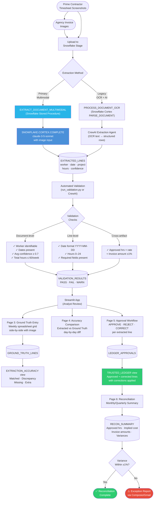

# Timesheet Reconciliation System

A hackathon project that converts timesheet screenshots and invoice images into a trusted, validated financial ledger — automatically. Built on **Snowflake Cortex**, **CrewAI**, and **Streamlit**.

---

## The Problem

Subcontracting billing chains create a silent audit gap: the prime contractor holds timesheet screenshots, the agency holds invoices, and neither side has a structured system of record. Every month, someone manually compares images to spreadsheets, hoping nothing slipped through.

This system eliminates that gap by:
1. Extracting structured data directly from images using Claude vision (via Snowflake Cortex)
2. Validating extracted data against configurable rules
3. Letting analysts enter or review ground truth inline
4. Producing a trusted approved ledger as the source of truth for reconciliation

---

## Business Process Flow



---

## Technology Stack

| Layer | Technology | Role |
|---|---|---|
| **Data Store** | Snowflake (`RECONCILIATION.PUBLIC`) | Tables, views, stored procedures, stage |
| **AI Extraction** | Snowflake Cortex (`CORTEX.COMPLETE`) | Sends images to Claude 3.5 Sonnet for multimodal extraction |
| **OCR Fallback** | Snowflake Cortex (`CORTEX.PARSE_DOCUMENT`) | Text-only OCR when multimodal is unavailable |
| **Agent Orchestration** | CrewAI | Extraction, validation, and ground truth comparison agents |
| **Frontend** | Streamlit | 6-page analyst review app |
| **Language** | Python 3.11+ | All pipeline scripts and the web app |
| **Notifications** | Composio | Gmail exception alerts when variances exceed tolerance |

---

## How It Works

### Extraction (Two Paths)

#### Primary: Multimodal (Image → Claude)

The preferred path skips OCR entirely. A Snowflake stored procedure sends the raw image file to Claude 3.5 Sonnet via `SNOWFLAKE.CORTEX.COMPLETE`, asking for structured JSON back:

```sql
-- sql/setup.sql: EXTRACT_DOCUMENT_MULTIMODAL procedure
SELECT SNOWFLAKE.CORTEX.COMPLETE(
    'claude-3-5-sonnet',
    extraction_prompt,            -- JSON schema + rules
    TO_FILE('@DOCUMENTS_STAGE_UNENC', filename)  -- raw image
) INTO llm_response;
```

The response is parsed from JSON and inserted directly into `EXTRACTED_LINES`. `EXTRACT_ALL_MULTIMODAL` runs this across all documents in a single set-based `INSERT`, letting Snowflake parallelize the Cortex calls automatically.

The extraction prompt instructs Claude to:
- Capture **every** project row per day (timesheets typically have 2–3 projects per day)
- Extract the source-system alphanumeric project code (e.g. `006GI00000OBhiL`) into `project_code`
- Return hours as decimals, dates as `YYYY-MM-DD`
- Score confidence per field based on image clarity

#### Legacy: OCR → CrewAI Agent

When multimodal is unavailable, `PROCESS_DOCUMENT_OCR` runs `SNOWFLAKE.CORTEX.PARSE_DOCUMENT` to get raw OCR text, which is then passed to the `ExtractionAgent` (in `agents/extraction_agent.py`) via CrewAI. The agent interprets the noisy OCR output and returns a typed `ExtractionResult` Pydantic model.

---

### Validation

`run_validation.py` (and the `ValidationAgent` in `agents/validation_agent.py`) applies three tiers of checks, writing results to `VALIDATION_RESULTS`:

**Document-level**
- `WORKER_IDENTIFIABLE` — at least one worker name is present
- `DATES_PRESENT` — at least one valid date extracted
- `TOTAL_HOURS_REASONABLE` — weekly total ≤ 60h (WARN if exceeded)
- `EXTRACTION_CONFIDENCE` — average confidence ≥ 0.7 (WARN if below)

**Line-level** (applied to each extracted row)
- `VALID_DATE_FORMAT` — date parses as `YYYY-MM-DD`
- `HOURS_IN_RANGE` — hours between 0 and 24
- `REQUIRED_FIELDS_PRESENT` — worker, work_date, and hours are non-null

**Cross-artifact** (reconciliation)
- `approved_hours × hourly_rate ≈ invoice_amount` within ±1% tolerance

---

### Analyst Review (Streamlit App)

`app.py` is a 6-page Streamlit application. Pages are navigated from the sidebar. All data reads and writes go through `run_query()` / `run_execute()`, which use a cached Snowflake connection loaded from `~/.snowflake/connections.toml` (connection name: `hack`).

| Page | Purpose |
|---|---|
| **1. Documents & OCR** | Upload images to Snowflake stage, trigger OCR, preview raw OCR text |
| **2. Extraction & Validation** | Re-extract individual docs via multimodal, view extracted lines and validation results, monitor pipeline status |
| **3. Ground Truth Entry** | Side-by-side view of the original image + an editable weekly grid (Sat–Fri). Analyst enters or corrects hours per project per day. Saved to `GROUND_TRUTH_LINES`. |
| **4. Accuracy Comparison** | Color-coded day-level diff between AI-extracted and ground truth hours. Shows MATCH / DISCREPANCY / MISSING / EXTRA per row. |
| **5. Approval Workflow** | Per-line APPROVE / REJECT / CORRECT decisions. Bulk approve available. Corrections capture replacement hours, date, and project. Results go into `LEDGER_APPROVALS`. |
| **6. Reconciliation** | Monthly/quarterly aggregations from `TRUSTED_LEDGER`, variance warnings vs. `RECON_SUMMARY`. |

---

### Trusted Ledger

`TRUSTED_LEDGER` is a view that joins `EXTRACTED_LINES` with `LEDGER_APPROVALS`, applying corrections inline:

```sql
SELECT
    COALESCE(a.corrected_hours,   e.hours)      AS hours,
    COALESCE(a.corrected_date,    e.work_date)  AS work_date,
    COALESCE(a.corrected_project, e.project)    AS project,
    ...
FROM EXTRACTED_LINES e
INNER JOIN LEDGER_APPROVALS a ON e.line_id = a.line_id
WHERE a.decision IN ('APPROVED', 'CORRECTED');
```

Only lines explicitly approved or corrected by an analyst appear here. This becomes the financial system of record.

---

## Data Model

```
RAW_DOCUMENTS          EXTRACTED_LINES         VALIDATION_RESULTS
─────────────          ───────────────         ──────────────────
doc_id (PK)    ──┬──▶  line_id (PK)       ◀──  validation_id (PK)
doc_type            │   doc_id (FK)             doc_id (FK)
file_path           │   worker                  line_id (FK, nullable)
ocr_text            │   work_date               rule_name
ocr_status          │   project                 status (PASS/FAIL/WARN)
ingested_ts         │   project_code            details
                    │   hours                   computed_value
                    │   extraction_confidence
                    │   raw_text_snippet        GROUND_TRUTH_LINES
                    │                          ──────────────────
                    │                           gt_line_id (PK)
                    │   LEDGER_APPROVALS        doc_id (FK)
                    │   ───────────────         worker
                    └▶  line_id (FK)            work_date
                        doc_id (FK)             project
                        decision                hours
                        corrected_*             entered_by
                        reason
                        reviewer

RECON_SUMMARY          VIEWS
─────────────          ─────
period_month           TRUSTED_LEDGER      — approved+corrected lines
period_quarter         EXTRACTION_ACCURACY — extracted vs ground truth
approved_hours         PIPELINE_STATUS     — per-doc processing overview
implied_cost
variance_subsub
variance_my
```

---

## Setup

### 1. Snowflake

Run `sql/setup.sql` in your Snowflake account. This creates:
- Database `RECONCILIATION`, schema `PUBLIC`
- Stage `DOCUMENTS_STAGE` (for OCR path) and `DOCUMENTS_STAGE_UNENC` (for multimodal — must be unencrypted for `TO_FILE()`)
- All tables, views, and stored procedures

Add a `[hack]` connection profile to `~/.snowflake/connections.toml`:
```toml
[hack]
account   = "your-account-identifier"
user      = "your-username"
password  = "your-password"
warehouse = "DEFAULT_WH"
```

### 2. Python Environment

```bash
python -m venv .venv
source .venv/bin/activate
pip install -r requirements.txt
```

### 3. Environment Variables (for standalone scripts)

Create `.env`:
```
SNOWFLAKE_ACCOUNT=your-account
SNOWFLAKE_USER=your-user
SNOWFLAKE_PASSWORD=your-password
SNOWFLAKE_DATABASE=RECONCILIATION
SNOWFLAKE_SCHEMA=PUBLIC
SNOWFLAKE_WAREHOUSE=DEFAULT_WH
```

### 4. Run

```bash
# Streamlit app (full workflow)
streamlit run app.py

# Standalone: multimodal extraction on all staged documents
python run_extraction_cortex.py

# Standalone: legacy CrewAI extraction on hardcoded OCR samples
python run_extraction.py

# Standalone: validation of EXTRACTED_LINES
python run_validation.py
```

---

## Project Structure

```
hack/
├── app.py                      # 6-page Streamlit app
├── crew.py                     # TimesheetReconciliationCrew orchestrator
├── cortex_llm.py               # Custom litellm wrapper for Snowflake Cortex
├── run_extraction_cortex.py    # Multimodal extraction script (preferred)
├── run_extraction.py           # Legacy CrewAI extraction script
├── run_validation.py           # Validation pipeline script
├── requirements.txt
├── sql/
│   └── setup.sql               # Full Snowflake DDL + stored procedures
└── agents/
    ├── __init__.py
    ├── extraction_agent.py     # CrewAI agent: OCR text → ExtractionResult
    ├── validation_agent.py     # CrewAI agent: ValidationResult + ReconciliationResult
    └── ground_truth_agent.py   # CrewAI agent: AccuracyReport vs ground truth
```
