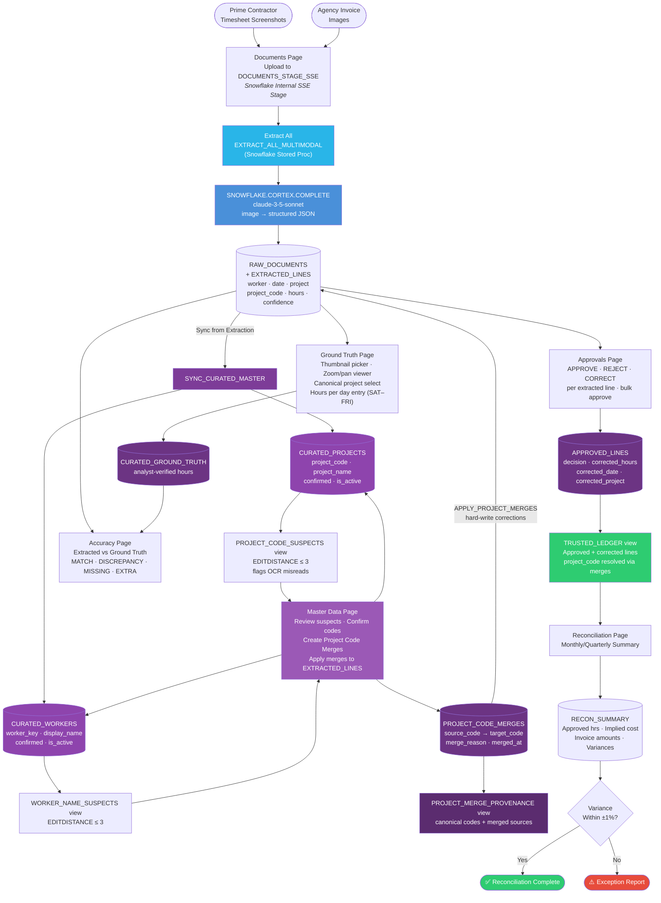

# Timesheet Reconciliation System

A hackathon project that converts timesheet screenshots and invoice images into a trusted, validated financial ledger — automatically. Built on **Snowflake Cortex**, **Claude AI**, and a **Next.js** analyst app.

---

## The Problem

Subcontracting billing chains create a silent audit gap: the prime contractor holds timesheet screenshots, the agency holds invoices, and neither side has a structured system of record. Every month, someone manually compares images to spreadsheets, hoping nothing slipped through.

This system eliminates that gap by:
1. Extracting structured data directly from images using Claude vision (via Snowflake Cortex)
2. Validating extracted data against configurable rules
3. Letting analysts enter or review ground truth inline
4. Producing a trusted approved ledger as the source of truth for reconciliation

---

## Business Process Flow



> **✦ Curated tables** (`CURATED_*`, `APPROVED_LINES`) contain analyst-reviewed or auto-synced reference data with a `curation_source` and `curation_note` tracking how each record was created or updated.

---

## Technology Stack

| Layer | Technology | Role |
|---|---|---|
| **Data Store** | Snowflake (`RECONCILIATION.PUBLIC`) | Tables, views, stored procedures, SSE stage |
| **AI Extraction** | Snowflake Cortex (`CORTEX.COMPLETE`) | Sends images to Claude 3.5 Sonnet for multimodal extraction |
| **Frontend** | Next.js 16 (App Router) + TypeScript | 6-page analyst review app at `localhost:3000` |
| **UI** | Tailwind CSS + shadcn/ui + TanStack Query v5 | Component library, data fetching, optimistic updates |
| **OCR Fallback** | Snowflake Cortex (`CORTEX.PARSE_DOCUMENT`) | Text-only OCR (legacy path, unused in current frontend) |
| **Agent Orchestration** | CrewAI | Legacy extraction + validation agents (Python scripts) |
| **Language** | Python 3.11+ / TypeScript | Python pipeline scripts; TypeScript Next.js app |

---

## How It Works

### Extraction (Two Paths)

#### Primary: Multimodal (Image → Claude)

The preferred path skips OCR entirely. A Snowflake stored procedure sends the raw image file to Claude 3.5 Sonnet via `SNOWFLAKE.CORTEX.COMPLETE`, asking for structured JSON back:

```sql
-- sql/setup.sql: EXTRACT_DOCUMENT_MULTIMODAL procedure
SELECT SNOWFLAKE.CORTEX.COMPLETE(
    'claude-3-5-sonnet',
    extraction_prompt,            -- JSON schema + rules
    TO_FILE('@DOCUMENTS_STAGE_SSE', filename)  -- raw image (SSE stage required)
) INTO llm_response;
```

The response is parsed from JSON and inserted directly into `EXTRACTED_LINES`. `EXTRACT_ALL_MULTIMODAL` runs this across all documents in a single set-based `INSERT`, letting Snowflake parallelize the Cortex calls automatically.

The extraction prompt instructs Claude to:
- Capture **every** project row per day (timesheets typically have 2–3 projects per day)
- Extract the source-system alphanumeric project code (e.g. `006GI00000OBhiL`) into `project_code`
- Return hours as decimals, dates as `YYYY-MM-DD`
- Score confidence per field based on image clarity

#### Legacy: OCR → CrewAI Agent

When multimodal is unavailable, `PROCESS_DOCUMENT_OCR` runs `SNOWFLAKE.CORTEX.PARSE_DOCUMENT` to get raw OCR text, which is then passed to the `ExtractionAgent` (in `agents/extraction_agent.py`) via CrewAI. The agent interprets the noisy OCR output and returns a typed `ExtractionResult` Pydantic model.

---

### Validation

`run_validation.py` (and the `ValidationAgent` in `agents/validation_agent.py`) applies three tiers of checks, writing results to `VALIDATION_RESULTS`:

**Document-level**
- `WORKER_IDENTIFIABLE` — at least one worker name is present
- `DATES_PRESENT` — at least one valid date extracted
- `TOTAL_HOURS_REASONABLE` — weekly total ≤ 60h (WARN if exceeded)
- `EXTRACTION_CONFIDENCE` — average confidence ≥ 0.7 (WARN if below)

**Line-level** (applied to each extracted row)
- `VALID_DATE_FORMAT` — date parses as `YYYY-MM-DD`
- `HOURS_IN_RANGE` — hours between 0 and 24
- `REQUIRED_FIELDS_PRESENT` — worker, work_date, and hours are non-null

**Cross-artifact** (reconciliation)
- `approved_hours × hourly_rate ≈ invoice_amount` within ±1% tolerance

---

### Analyst Review (Next.js App)

`frontend/` is a Next.js 16 App Router application. All data reads and writes go through typed API routes (`frontend/app/api/`) backed by `runQuery()` / `runExecute()` in `lib/snowflake.ts`. Run with `cd frontend && npm run dev`.

| Page | Purpose |
|---|---|
| **Documents** | Upload images to Snowflake SSE stage, per-card extract (▶) or Extract All, delete with confirmation. Click any thumbnail to open the inline detail panel (image + extracted lines table). |
| **Ground Truth** | Thumbnail picker (green badge = GT saved, amber = extracted, grey = none). Click a doc to open: zoom/pan image viewer (defaults to bottom-third) above an editable SAT–FRI hours grid. Project rows use a canonical `CURATED_PROJECTS` Select dropdown, pre-filled from extraction. Add/remove rows freely. |
| **Master Data** | Four tabs: **Projects** (confirm/edit canonical codes), **Workers** (confirm/edit workers), **Merges** (create source→target project code merges, apply corrections to `EXTRACTED_LINES`), **Provenance** (audit trail of all merges grouped by canonical code). Status banner guides the analyst step-by-step. |
| **Accuracy** | Color-coded day-level diff between AI-extracted and ground truth hours. Shows MATCH / DISCREPANCY / MISSING / EXTRA per row. |
| **Approvals** | Per-line APPROVE / REJECT / CORRECT decisions. Bulk approve available. Corrections capture replacement hours, date, and project. Results go into `APPROVED_LINES`. |
| **Reconciliation** | Monthly/quarterly aggregations from `TRUSTED_LEDGER`, variance warnings vs. `RECON_SUMMARY`. |

---

### Trusted Ledger

`TRUSTED_LEDGER` is a view that joins `EXTRACTED_LINES` with `APPROVED_LINES`, applying corrections inline:

```sql
SELECT
    COALESCE(a.corrected_hours,   e.hours)      AS hours,
    COALESCE(a.corrected_date,    e.work_date)  AS work_date,
    COALESCE(a.corrected_project, e.project)    AS project,
    ...
FROM EXTRACTED_LINES e
INNER JOIN APPROVED_LINES a ON e.line_id = a.line_id
WHERE a.decision IN ('APPROVED', 'CORRECTED');
```
```

Only lines explicitly approved or corrected by an analyst appear here. This becomes the financial system of record.

---

## Data Model

```
── RAW TIER ─────────────────────────────────────────────────────────────────

RAW_DOCUMENTS          EXTRACTED_LINES         VALIDATION_RESULTS
─────────────          ───────────────         ──────────────────
doc_id (PK)    ──┬──▶  line_id (PK)       ◀──  validation_id (PK)
doc_type            │   doc_id (FK)             doc_id (FK)
file_path           │   worker                  line_id (FK, nullable)
ocr_text            │   work_date               rule_name
ocr_status          │   project                 status (PASS/FAIL/WARN)
ingested_ts         │   project_code            details
                    │   hours
                    │   extraction_confidence
                    │   raw_text_snippet

── CURATED TIER ─────────────────────────────────────────────────────────────

CURATED_PROJECTS       CURATED_WORKERS         CURATED_GROUND_TRUTH
────────────────       ───────────────         ────────────────────
project_code (PK)      worker_key (PK)         gt_id (PK)
project_name           display_name            doc_id (FK)
confirmed              confirmed               worker
is_active              is_active               work_date
first_seen             first_seen              project
curation_source ──┐    curation_source ──┐     hours
curation_note     │    curation_note     │     entered_by
matched_from_code │                      │     curation_note
                  │                      │
   auto_extracted ┤    auto_extracted ───┤  (new codes/workers auto-added
   fuzzy_match    ┤    fuzzy_match    ───┤   after each extraction run;
   manual         ┘    manual         ──┘   confirmed by analyst)

APPROVED_LINES
──────────────
approval_id (PK)
line_id (FK) ──▶ EXTRACTED_LINES
doc_id (FK)
decision (APPROVED | REJECTED | CORRECTED)
corrected_worker / corrected_date / corrected_project / corrected_hours
reason · reviewer · reviewed_ts

── VIEWS ────────────────────────────────────────────────────────────────────

TRUSTED_LEDGER          — EXTRACTED_LINES ⋈ APPROVED_LINES, corrections applied
EXTRACTION_ACCURACY     — EXTRACTED_LINES vs CURATED_GROUND_TRUTH, diff per line
PIPELINE_STATUS         — per-doc processing overview
PROJECT_CODE_SUSPECTS   — extracted codes within edit-distance 3 of confirmed master
WORKER_NAME_SUSPECTS    — extracted workers within edit-distance 3 of confirmed master

── AGGREGATES ───────────────────────────────────────────────────────────────

RECON_SUMMARY
─────────────
period_month · period_quarter
approved_hours · implied_cost
invoice_subsub_amount · invoice_my_amount
variance_subsub · variance_my
```

---

## Setup

### 1. Snowflake

Run `sql/setup.sql` in your Snowflake account. This creates:
- Database `RECONCILIATION`, schema `PUBLIC`
- Stage `DOCUMENTS_STAGE` (for OCR path) and `DOCUMENTS_STAGE_SSE` (for multimodal — must use `ENCRYPTION = (TYPE = 'SNOWFLAKE_SSE')` for `TO_FILE()` to work with Cortex)
- All tables, views, and stored procedures

Add a `[hack]` connection profile to `~/.snowflake/connections.toml`:
```toml
[hack]
account   = "your-account-identifier"
user      = "your-username"
password  = "your-password"
warehouse = "DEFAULT_WH"
```

### 2. Python Environment

```bash
python -m venv .venv
source .venv/bin/activate
pip install -r requirements.txt
```

### 3. Environment Variables (for standalone scripts)

Create `.env`:
```
SNOWFLAKE_ACCOUNT=your-account
SNOWFLAKE_USER=your-user
SNOWFLAKE_PASSWORD=your-password
SNOWFLAKE_DATABASE=RECONCILIATION
SNOWFLAKE_SCHEMA=PUBLIC
SNOWFLAKE_WAREHOUSE=DEFAULT_WH
```

### 4. Run

```bash
# Next.js analyst app (primary UI) → http://localhost:3000
cd frontend && npm install && npm run dev

# Standalone: multimodal extraction on all staged documents
python run_extraction_cortex.py

# Standalone: validation of EXTRACTED_LINES
python run_validation.py

# Legacy Streamlit app (superseded by Next.js frontend)
streamlit run app.py
```

---

## Project Structure

```
hack/
├── sql/
│   └── setup.sql                   # Full Snowflake DDL + stored procedures + views
├── frontend/                       # Next.js 16 analyst app (primary UI)
│   ├── app/
│   │   ├── documents/page.tsx      # Upload + extract + thumbnail grid
│   │   ├── ground-truth/page.tsx   # GT entry with zoom/pan viewer + canonical project select
│   │   ├── master-data/page.tsx    # Projects · Workers · Merges · Provenance tabs
│   │   ├── accuracy/page.tsx       # Extracted vs GT diff
│   │   ├── approvals/page.tsx      # Per-line approve/reject/correct
│   │   ├── reconciliation/page.tsx # Monthly summary + variance check
│   │   └── api/                    # 11 typed Next.js API routes → Snowflake
│   ├── hooks/queries.ts            # All TanStack Query hooks
│   ├── lib/
│   │   ├── snowflake.ts            # Singleton Snowflake connection
│   │   └── types.ts                # TypeScript interfaces for all DB tables/views
│   └── components/                 # PageHeader, MetricCard, ConfirmationDialog, etc.
├── app.py                          # Legacy 6-page Streamlit app
├── crew.py                         # TimesheetReconciliationCrew orchestrator (legacy)
├── cortex_llm.py                   # Custom litellm wrapper for Snowflake Cortex (legacy)
├── run_extraction_cortex.py        # Multimodal extraction script
├── run_extraction.py               # Legacy CrewAI extraction script
├── run_validation.py               # Validation pipeline script
├── requirements.txt
└── agents/
    ├── extraction_agent.py         # CrewAI agent: OCR text → ExtractionResult (legacy)
    ├── validation_agent.py         # CrewAI agent: ValidationResult (legacy)
    └── ground_truth_agent.py       # CrewAI agent: AccuracyReport (legacy)
```
