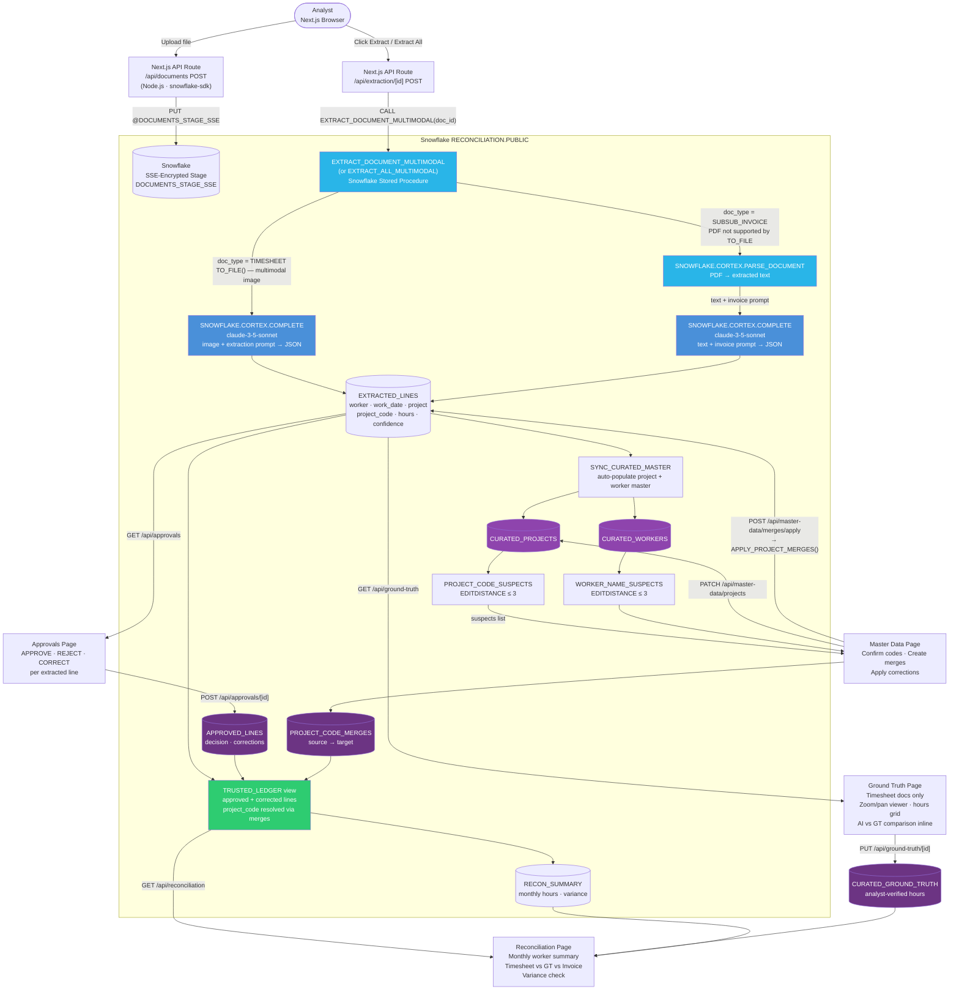

# Architecture

## Data Flow



---

## How LLM Calls Work

There are **no Python agents** in this system. All AI extraction happens inside Snowflake via stored procedures that call `SNOWFLAKE.CORTEX.COMPLETE` (Claude 3.5 Sonnet). The Next.js frontend triggers extraction by calling these stored procedures directly through the Snowflake SDK.

### Timesheets (image files)

The stored procedure sends the raw image directly to Claude 3.5 Sonnet via `SNOWFLAKE.CORTEX.COMPLETE` with a multimodal prompt:

```sql
-- EXTRACT_DOCUMENT_MULTIMODAL — timesheet path
SELECT SNOWFLAKE.CORTEX.COMPLETE(
    'claude-3-5-sonnet',
    [{'role':'user','content':[
        {'type':'text',  'text': :timesheet_prompt},
        {'type':'image', 'source_media_type':'image/jpeg',
         'source': TO_FILE('@DOCUMENTS_STAGE_SSE', :filename)}
    ]}]
) INTO :llm_response;
```

The prompt instructs Claude to capture every project row per day, extract the alphanumeric project code (e.g. `006GI00000OBhiL`), return hours as decimals and dates as `YYYY-MM-DD`, and score confidence per field.

### Subcontract Invoices (PDF files)

`CORTEX.COMPLETE` does not support PDF via `TO_FILE`. The procedure falls back to a two-step path:

```sql
-- Step 1: Extract text from PDF
SELECT SNOWFLAKE.CORTEX.PARSE_DOCUMENT(
    '@DOCUMENTS_STAGE_SSE', :filename,
    {'mode': 'LAYOUT'}
):content::STRING INTO :pdf_text;

-- Step 2: Send text + invoice prompt to Claude
SELECT SNOWFLAKE.CORTEX.COMPLETE(
    'claude-3-5-sonnet',
    :invoice_prompt || :pdf_text
) INTO :llm_response;
```

The invoice prompt asks Claude to extract: worker name, total hours, and the last day of the billing month as `work_date`.

---

## Master Data Curation

After each extraction run, `SYNC_CURATED_MASTER` auto-populates `CURATED_PROJECTS` and `CURATED_WORKERS` with any newly seen codes and worker names. The `PROJECT_CODE_SUSPECTS` and `WORKER_NAME_SUSPECTS` views flag entries within edit-distance 3 of an existing confirmed master record (OCR misreads like `006QI` → `006GI`).

Analysts resolve these in the **Master Data → Merges** tab by creating `PROJECT_CODE_MERGES` records, then clicking **Apply Merges** to call `APPLY_PROJECT_MERGES()` which hard-writes corrections back to `EXTRACTED_LINES`. The `TRUSTED_LEDGER` view also resolves codes through the merge table as a belt-and-suspenders fallback.

---

## Trusted Ledger

`TRUSTED_LEDGER` is a view that joins `EXTRACTED_LINES` with `APPROVED_LINES`, applying corrections inline and resolving project codes through the merge table:

```sql
SELECT
    e.doc_id,
    COALESCE(a.corrected_hours,   e.hours)      AS hours,
    COALESCE(a.corrected_date,    e.work_date)  AS work_date,
    COALESCE(a.corrected_project, e.project)    AS project,
    COALESCE(m.target_code,       e.project_code) AS project_code,
    ...
FROM EXTRACTED_LINES e
INNER JOIN APPROVED_LINES a ON e.line_id = a.line_id
LEFT  JOIN PROJECT_CODE_MERGES m ON e.project_code = m.source_code
WHERE a.decision IN ('APPROVED', 'CORRECTED');
```

Only lines explicitly approved or corrected by an analyst appear here. This is the financial system of record.
